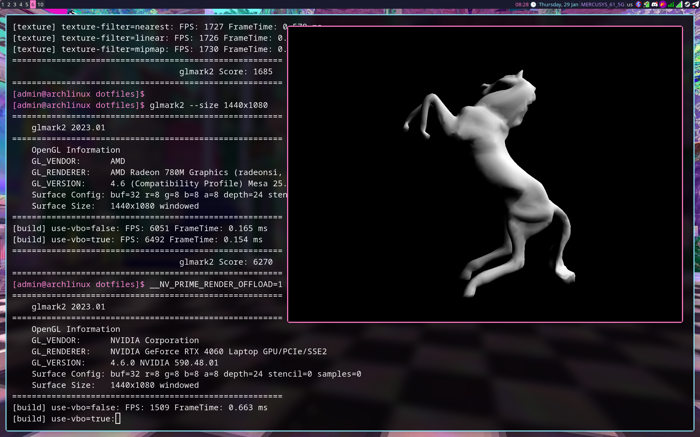

# 🌸 vapor-rice-i3

> Declarative Arch Linux dotfiles with vaporwave aesthetics
>
> `./install.sh` — use it for install this rice

## Screenshots


## Snapshots

System snapshot support for easy rollback:

- **ext4/xfs/etc**: Timeshift with rsync (auto-snapshots on boot, daily, weekly, monthly)
- **Btrfs**: Snapper with native snapshots (auto-snapshots on pacman, bootable from GRUB)

Commands: `snapshot-create`, `snapshot-list`, `snapshot-delete`, `snapshot-rollback`

## GPU Support

This rice uses a **portable, offload-only GPU model** designed to work safely on any machine:

| GPU Type | Behavior |
|----------|----------|
| Intel/AMD only | Full driver installation and Xorg configuration |
| NVIDIA only | NVIDIA drivers installed, standard configuration |
| Hybrid (iGPU + NVIDIA) | iGPU is primary, NVIDIA available for offload only |

### Hybrid Graphics Policy

For systems with both integrated (Intel/AMD) and discrete (NVIDIA) GPUs:

- **Default GPU**: Always the integrated GPU (iGPU)
- **NVIDIA**: Available as an optional accelerator via per-process offload
- **No automatic GPU switching**: No optimus-manager, envycontrol, or similar tools
- **No Xorg configs for NVIDIA**: Prevents black screens and boot issues

### Using NVIDIA for Specific Applications

To run an application on the NVIDIA GPU:

```bash
__NV_PRIME_RENDER_OFFLOAD=1 __GLX_VENDOR_LIBRARY_NAME=nvidia <command>
```

Example:
```bash
__NV_PRIME_RENDER_OFFLOAD=1 __GLX_VENDOR_LIBRARY_NAME=nvidia glxgears
```



This design prioritizes **safety and portability** over automatic NVIDIA activation.

## Steam & Gaming

Steam is installed declaratively with a complete Vulkan stack for gaming:

### What's Installed

| Package | Purpose |
|---------|---------|
| `steam` | Steam client (Proton/runtime managed by Steam) |
| `vulkan-icd-loader` | Vulkan loader for native Vulkan games |
| `vulkan-tools` | Diagnostics (`vulkaninfo`) |
| `lib32-*` | 32-bit libraries required by Proton |

### GPU-Aware Launchers

The installer creates hardware-aware Steam launchers following the project's explicit policy pattern:

| Launcher | GPU | When Created |
|----------|-----|--------------|
| **Steam** | Default (iGPU) | Always |
| **Steam (NVIDIA)** | NVIDIA offload | Only if NVIDIA GPU detected |
| **Steam (AMD dGPU)** | AMD discrete | Only if discrete AMD GPU detected |

Launchers appear in Rofi and application menus. GPU selection is always explicit - no auto-switching.

### Per-Game GPU Selection

For games that need specific GPU settings, Steam provides per-game launch options.

NVIDIA offload:
```
__NV_PRIME_RENDER_OFFLOAD=1 __GLX_VENDOR_LIBRARY_NAME=nvidia %command%
```

AMD discrete GPU:
```
DRI_PRIME=1 %command%
```

