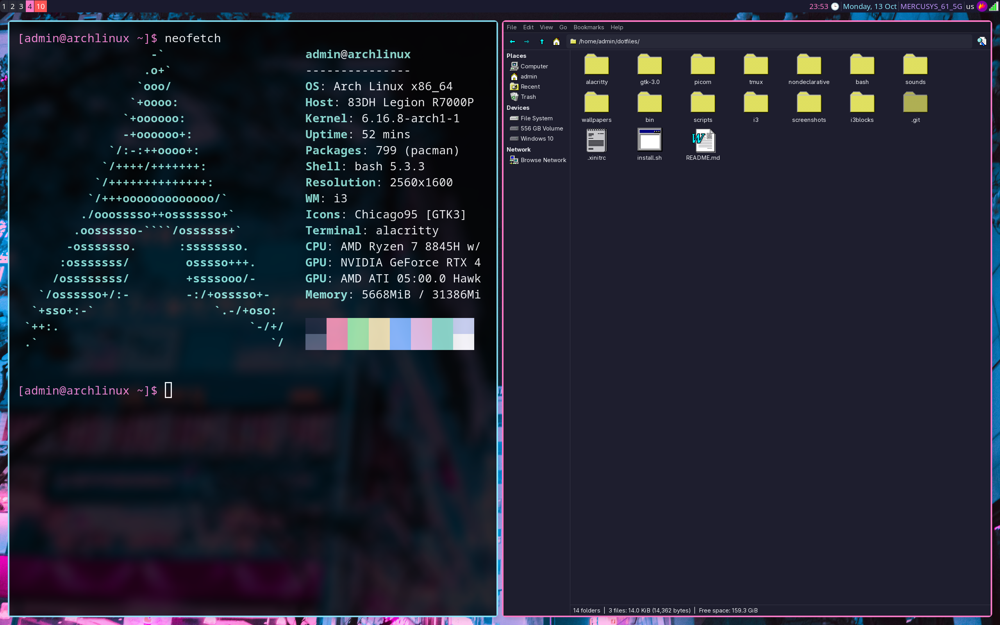

# 🌸 vapor-rice-i3

> Declarative Arch Linux dotfiles with vaporwave aesthetics
>
> `./install.sh` — use it for install this rice

## Screenshots

## System Snapshots (Btrfs)

This rice includes automatic system snapshot support using **Snapper** on Btrfs filesystems. Snapshots allow you to easily rollback your system to a previous state if something goes wrong.

### Requirements

- Btrfs filesystem for root partition
- Recommended subvolume layout: `@`, `@home`, `@snapshots`

### Features

- **Automatic pre/post snapshots** on every package update (via `snap-pac`)
- **Timeline snapshots** - hourly snapshots with automatic cleanup
- **Bootable snapshots** - boot into any snapshot from GRUB menu (via `grub-btrfs`)

### Commands

| Command | Description |
|---------|-------------|
| `snapshot-create "description"` | Create a manual snapshot |
| `snapshot-list` | List all snapshots |
| `snapshot-diff 1 5` | Compare changes between snapshots 1 and 5 |
| `snapshot-delete 5` | Delete snapshot number 5 |
| `snapshot-rollback` | Show rollback instructions |

### Rollback

To rollback your system:
1. Reboot and select **"Arch Linux snapshots"** in the GRUB menu
2. Choose the snapshot you want to boot into
3. For permanent rollback, see `snapshot-rollback` command

> **Note:** If your root filesystem is not Btrfs, snapshot setup will be skipped during installation.

